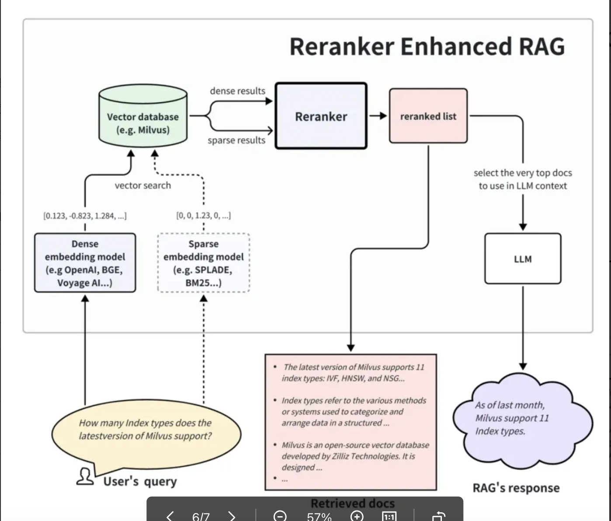

## 3.3 Re-ranking

A **reranker** is a critical component in modern information retrieval pipelines. It evaluates the candidate results returned by the initial retriever(s) and **re-orders** them to improve **relevance**.

In **RAG** systems, reranking is typically applied **after retrieval** to better estimate the semantic match between the user query and each retrieved document chunk. This produces a more accurate top-K context set, which ultimately improves retrieval quality and downstream answer generation.

### Why integrate a reranker in RAG?

Integrating a reranker into a RAG pipeline can significantly improve answer precision because it can select the document chunks that are most semantically aligned with the query—across either **single-path** retrieval or **multi-path** retrieval (e.g., dense + BM25).

A reranker also improves final quality when the pipeline intentionally increases recall (e.g., retrieving a larger candidate pool via multiple retrievers). With more candidates available, the reranker can perform finer-grained filtering to surface the best evidence.

Practically, reranking helps by:
- removing weakly related chunks from the first-stage retrieval results,
- narrowing the context passed to the LLM down to the most relevant subset,
- improving LLM attention over the provided context (less distraction),
- reducing token usage and therefore lowering inference cost.

### Model Architecture Note

Dense retrieval embeddings typically use a **bi-encoder** architecture, while **bge-reranker-large** uses a **cross-encoder** architecture. In general, cross-encoders can outperform bi-encoders for ranking because they jointly encode the *(query, document)* pair and model deeper interaction signals, at the cost of higher compute per candidate.

